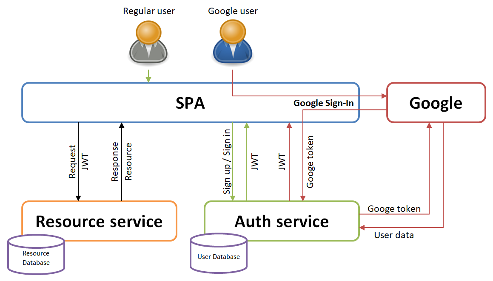
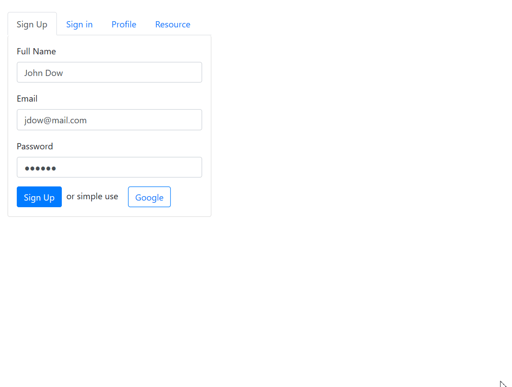

# Combination of local OAuth2 authentication and Google Sign-in in Spring Boot application

This example demonstrates the situation when you have Single Page Application (SPA), your own 
[authorization server][1] that works with JWT tokens and your own user database, but you need to add 
authentication via [Google Sign-in][2], so that Google users are transparently registered in the local user database 
and your JWT token was generated for them as well.

## Used stack

- Spring Boot 2.2.x
- [Spring Security OAuth Boot 2 Autoconfig][3]
- Spring Web MVC
- Google API Client
- H2 Database
- Lombok
- Bootstrap
- JQuery

## Demo

## Used resources

- [Spring Security OAuth Boot 2 Autoconfig][4]
- [Integrating Google Sign-In into your web app][5]
- [OAuth 2 Developers Guide][6]

[1]: https://docs.spring.io/spring-security-oauth2-boot/docs/current/reference/htmlsingle/#boot-features-security-oauth2-authorization-server
[2]: https://developers.google.com/identity/sign-in/web
[3]: https://github.com/spring-projects/spring-security-oauth2-boot
[4]: https://docs.spring.io/spring-security-oauth2-boot/docs/current/reference/htmlsingle
[5]: https://developers.google.com/identity/sign-in/web/sign-in
[6]: https://projects.spring.io/spring-security-oauth/docs/oauth2.html